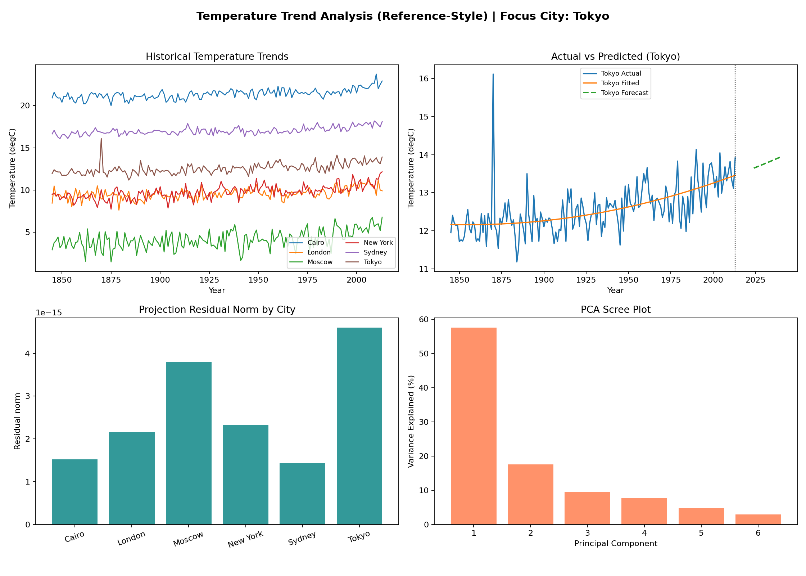
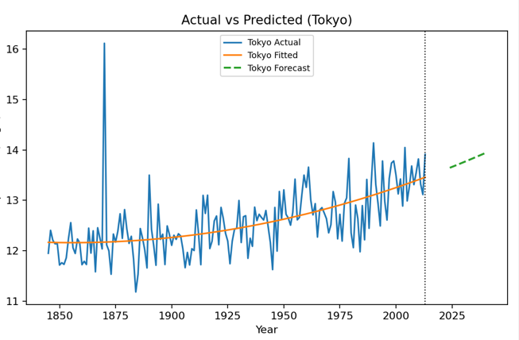
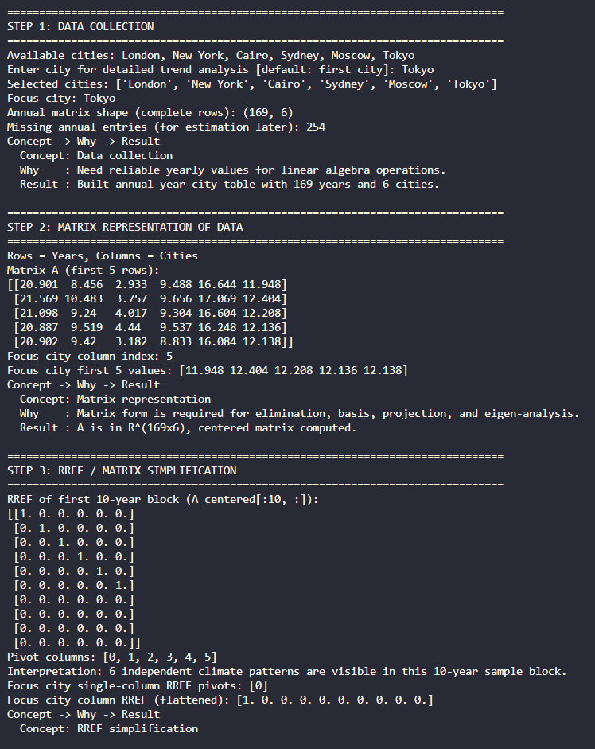
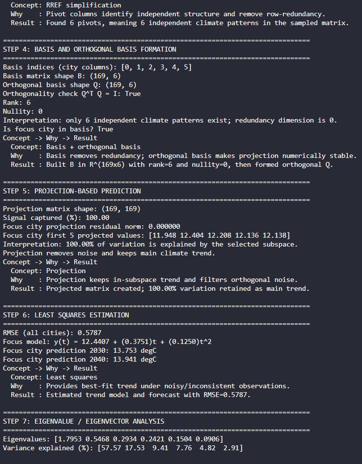
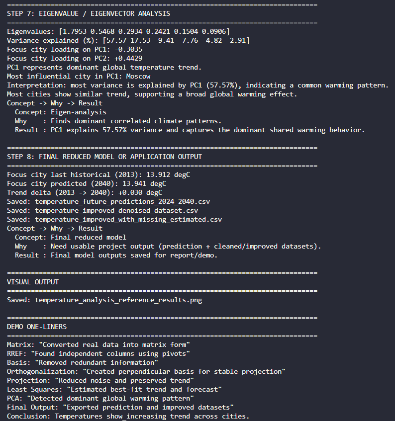
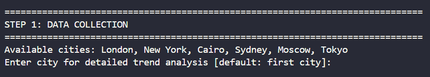

# Temperature Trend Analysis Using Linear Algebra

Predicting the future is usually a data science problem. We decided to answer it with plain
Linear Algebra instead. This project takes over 100 years of global city temperature records
and pushes them through a full pipeline of matrix operations - RREF, basis formation,
orthogonal projection, least squares, and eigenvalue decomposition - to detect climate
patterns and forecast temperatures up to 2040.

---

## Team

**Name:** Denis Mangla

**Name:** Harshit Chandak

**Name:** Hamza Sahapurwala

**Name:** Nikitha

---

## What This Project Does

We take the `GlobalLandTemperaturesByMajorCity.csv` dataset, narrow it down to 8 major world
cities (London, New York, Mumbai, Beijing, Cairo, Sydney, Moscow, Tokyo), and turn a century
of yearly average temperatures into a matrix. From there, every classic linear algebra concept
gets a real job to do:

| Concept | Job It Does Here |
|---|---|
| Matrix Representation | Organizes 100+ years x 8 cities into a clean numeric matrix |
| RREF (Row Reduction) | Finds which columns (cities) carry independent information |
| Basis Formation | Strips out redundant patterns, keeps the essential ones |
| Orthogonalization (QR) | Builds a stable, perpendicular basis for projection |
| Projection | Filters out noise, keeps the dominant temperature trend |
| Least Squares | Fits a best-fit curve and forecasts temperatures to 2040 |
| Eigen-analysis (PCA) | Finds the single biggest shared warming pattern across cities |

In short: raw CSV in, forecasted temperatures and a diagnosis of "is this a real global trend
or just noise" out.

---

## How It Works, Step by Step

### Step 1: Data Collection
The script reads the CSV, drops missing readings, and keeps only cities that have at least
100 years of data. This gives us a reliable pool of cities to analyze.

### Step 2: Matrix Representation
Years become rows, cities become columns. This is matrix `A`. Everything downstream depends
on getting this shape right, since RREF, projection, and eigen-analysis are all matrix
operations.

### Step 3: RREF / Matrix Simplification
A 10-year sample block is reduced to Row Reduced Echelon Form to find pivot columns -
essentially asking "which cities' temperature patterns are actually independent, and which
are just following someone else's lead?"

### Step 4: Basis and Orthogonal Basis Formation
Using the independent columns found above, we build a basis for the data, then run QR
decomposition to make it orthogonal. An orthogonal basis makes the next step (projection)
numerically stable and easy to compute.

### Step 5: Projection-Based Prediction
The data is projected onto the basis subspace. This keeps the "real" shared trend and
discards the leftover noise - think of it as filtering static out of a signal.

### Step 6: Least Squares Estimation
A quadratic curve is fit to each city's temperature history using least squares. This curve
is then extended out to the years 2024 through 2040 to generate the actual forecast.

### Step 7: Eigenvalue / Eigenvector Analysis
A covariance matrix is built across all cities and decomposed into eigenvalues and
eigenvectors (PCA). The first principal component usually captures the majority of the
variance - our way of checking whether cities are warming together as part of one global
pattern, rather than independently by coincidence.

### Step 8: Final Output
Everything comes together here: missing yearly values get estimated from the fitted model,
and three CSV files are exported along with a 4-panel results image.

---

## Output Files

Running the script produces the following in the `Results/` folder:

- `temperature_future_predictions_2024_2040.csv` - forecasted temperatures for all cities
- `temperature_improved_denoised_dataset.csv` - the projected, noise-filtered dataset
- `temperature_improved_with_missing_estimated.csv` - original dataset with gaps filled in
- `temperature_analysis_reference_results.png` - a 4-panel chart summarizing everything

---

## The Visual Output

The script generates a single figure with four panels:

1. **Historical Temperature Trends** - every city's raw yearly average, all on one chart
2. **Actual vs Predicted** - the focus city's real data, the model's fit, and its forecast
3. **Projection Residual Norm by City** - how much "noise" got filtered out per city
4. **PCA Scree Plot** - how much variance each principal component explains

 <br><br>

 <br><br>

 <br><br>

 <br><br>

 <br><br>

---

## Running It Yourself

### Requirements
```
pandas
numpy
matplotlib
```

### Setup
1. Place `GlobalLandTemperaturesByMajorCity.csv` in the same folder as the script.
2. Make sure a `Results/` folder exists (or the CSV/image exports will fail).
3. Run the script:
   ```
   python temperature_analysis.py "New York"
   ```
   The city name is optional - if you skip it, the script will prompt you, and if you skip
   that too, it defaults to the first available city.

### What You'll See
The terminal prints a step-by-step walkthrough of every linear algebra operation as it
happens, followed by a pop-up window with the 4-panel chart described above.



---

## Why Linear Algebra and Not "Real" Machine Learning

Because it works and it's transparent. Every number in the forecast can be traced
back to an actual matrix operation - no black box, no hidden layers. RREF tells us what's
independent, projection tells us what's signal versus noise, least squares gives us the
trend line, and PCA tells us whether that trend is shared globally or just local weirdness.
